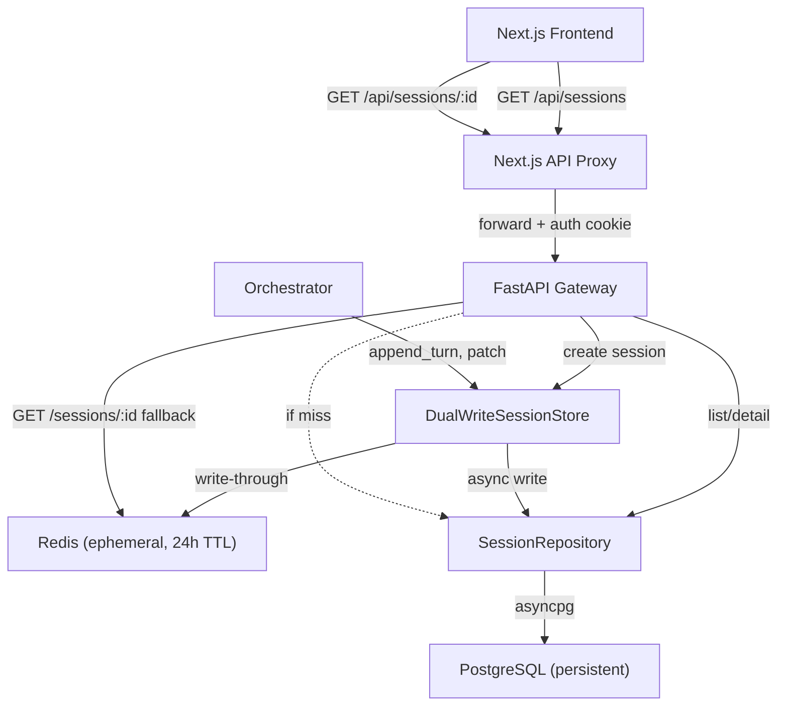

# Design Document: Session Persistence

## Overview

This design introduces persistent session storage in PostgreSQL alongside the existing Redis ephemeral store. A dual-write pattern ensures that session creation, patient context updates, and turn persistence flow to both Redis (for low-latency active sessions) and PostgreSQL (for long-term history). The Gateway session list and detail APIs are updated to read from PostgreSQL as the authoritative source, with Redis serving as a fast cache for active sessions. A new Alembic migration extends the existing `sessions` table with lifecycle columns, and a new frontend session detail page replaces the current redirect-to-chat behavior.

The core design principle is **non-blocking degradation**: PostgreSQL write failures are logged but never block the clinical workflow. Redis remains the primary store for active session reads during streaming; PostgreSQL becomes the source of truth for historical queries.

## Architecture



### Write Path

1. **Session creation**: `DualWriteSessionStore.create()` writes to Redis first (blocking), then to `SessionRepository` (fire-and-forget with error logging).
2. **Turn persistence**: `DualWriteSessionStore.append_turn()` writes to Redis (blocking), then inserts a row into `turns` via `SessionRepository` (fire-and-forget).
3. **Patient context patch**: `DualWriteSessionStore.patch()` updates Redis (blocking), then updates the `sessions.patient_context` JSONB column (fire-and-forget).

### Read Path

1. **Session list** (`GET /api/v1/sessions`): Reads exclusively from PostgreSQL via `SessionRepository`. Performs lazy close on any session that is `active` in PG but missing from Redis.
2. **Session detail** (`GET /api/v1/sessions/{id}`): Tries Redis first. On miss, falls back to PostgreSQL. Performs lazy close if the session was `active` in PG but absent from Redis.

## Components and Interfaces

### SessionRepository (new)

Location: `backend/app/orchestrator/session_repository.py`

```python
class SessionRepository:
    """PostgreSQL-backed persistent session and turn storage."""

    def __init__(self, pool: asyncpg.Pool, retention_days: int = 365):
        self._pool = pool
        self._retention_days = retention_days

    async def create_session(
        self, session_id: str, user_id: str,
        patient_context: dict, language: str,
    ) -> None: ...

    async def upsert_turn(
        self, session_id: str, turn_id: str,
        turn_index: int, query: str, response: dict,
    ) -> None: ...

    async def update_patient_context(
        self, session_id: str, patient_context: dict,
    ) -> None: ...

    async def get_session_detail(
        self, session_id: str,
    ) -> dict | None: ...

    async def list_sessions(
        self, user_id: str, include_archived: bool = False,
        limit: int = 50, offset: int = 0,
    ) -> tuple[list[dict], int]:
        """Returns (sessions_list, total_count) for pagination."""
        ...

    async def close_session(self, session_id: str) -> None: ...

    async def archive_expired(self, user_id: str) -> None: ...

    async def count_turns(self, session_id: str) -> int: ...
```

Note: `SessionRepository` has no knowledge of Redis. Lazy close and Redis-existence checks are handled by the `DualWriteSessionStore` or the gateway route handlers.

### DualWriteSessionStore (new)

Location: `backend/app/orchestrator/dual_write.py`

Wraps `SessionStore` (Redis) and `SessionRepository` (PostgreSQL). Implements the same interface as `SessionStore` so the Orchestrator can use it as a drop-in replacement.

```python
class DualWriteSessionStore:
    """Writes to Redis (blocking) + PostgreSQL (best-effort via asyncio.create_task)."""

    def __init__(
        self, redis_store: SessionStore,
        pg_repo: SessionRepository,
    ):
        self._redis = redis_store
        self._pg = pg_repo

    async def create(
        self, session_id: str, patient_context: dict,
        language: str = "fr", user_id: str | None = None,
    ) -> None: ...

    async def get(self, session_id: str) -> dict: ...

    async def get_or_fallback(self, session_id: str) -> dict | None:
        """Try Redis first; on miss, fall back to PG. Performs lazy close."""
        ...

    async def patch(self, session_id: str, **fields) -> None: ...

    async def append_turn(self, session_id: str, turn: dict) -> None: ...

    # Delegated to Redis store (active session management)
    async def register_session(self, user_id: str, session_id: str) -> None: ...
    async def count_user_sessions(self, user_id: str) -> int: ...
```

Key behavior:
- `create()`: Writes Redis first (blocking), then spawns `asyncio.create_task(_pg_create(...))` wrapped in try/except that logs warnings on failure. The gateway route passes `user_id` from the auth dependency. Note: this adds a `user_id` parameter not present on the original `SessionStore.create()` — this is safe because only the gateway route (not the Orchestrator) calls `create()`.
- `append_turn()`: Writes Redis first (blocking). Extracts `turn_id` and `query` from the turn dict, computes `turn_index` from the Redis conversation history length, builds a `response` dict from `diag` + `anti` + `warnings` + `references` keys, then spawns `asyncio.create_task(_pg_upsert_turn(...))`.
- `patch()`: Updates Redis first (blocking). If `patient_context` is in the patched fields, spawns `asyncio.create_task(_pg_update_context(...))`.
- `get()`: Delegates to Redis only (active session reads stay fast).
- `get_or_fallback()`: Tries Redis; on empty result, queries `SessionRepository.get_session_detail()`. If found in PG with status `active`, spawns a lazy close task.
- `list_user_sessions()` is **removed** from this class — the gateway list route calls `SessionRepository.list_sessions()` directly.

#### Fire-and-forget pattern

All PG writes use a helper that wraps the coroutine in `asyncio.create_task` with error handling:

```python
def _fire_and_forget(self, coro, operation: str, session_id: str, **ctx):
    async def _safe():
        try:
            await coro
        except Exception as exc:
            log.warning("pg_%s failed session=%s: %s", operation, session_id, exc)
    asyncio.create_task(_safe())
```

#### Turn record mapping

The orchestrator's `turn_record` dict has keys `turn_id`, `query`, `diag`, `anti`, `warnings`, `references`. The `DualWriteSessionStore.append_turn()` maps this to the `SessionRepository.upsert_turn()` signature:

```python
response = {
    "diag": turn.get("diag"),
    "anti": turn.get("anti"),
    "warnings": turn.get("warnings", []),
    "references": turn.get("references", []),
}
turn_index = len(current_redis_history)  # computed from Redis state
await self._pg.upsert_turn(session_id, turn["turn_id"], turn_index, turn["query"], response)
```

### Updated Gateway Routes

**`GET /api/v1/sessions`** — Changed to read from `SessionRepository.list_sessions()` directly (not through `DualWriteSessionStore`). Performs lazy archive of sessions older than `SESSION_RETENTION_DAYS`. Accepts optional `include_archived=true`, `limit` (default 50), and `offset` (default 0) query parameters. For each returned session with status `active`, checks Redis existence via `SessionStore.get()` and performs lazy close if absent.

**`GET /api/v1/sessions/{session_id}`** — Uses `DualWriteSessionStore.get_or_fallback()`: tries Redis first, falls back to PostgreSQL. If found in PG with status `active` but absent from Redis, performs lazy close. Returns 404 if not found in either store.

**`POST /api/v1/sessions`** — Updated to pass `user_id` (from the `require_role` auth dependency) to `DualWriteSessionStore.create()`.

### Updated Orchestrator

The `OrchestratorConfig` already accepts a `session_store: SessionStore`. The `DualWriteSessionStore` will be injected in its place during gateway lifespan setup. No changes to `Orchestrator` class itself — it calls `session_store.append_turn()` and `session_store.patch()` which the dual-write layer intercepts.

### Frontend Session Detail Page

Location: `frontend/src/app/(clinic)/sessions/[id]/page.tsx`

A `"use client"` component that replaces the current redirect-to-chat with a read-only consultation review page. Uses `useEffect` + `useState` to fetch `GET /api/sessions/{id}` and renders:
- Patient context header (age, sex, chief complaint, region)
- Chronological turn list with query, differential items, treatment lines, citations
- 404 handling with user-friendly message
- Loading skeleton during fetch (reuses `SkeletonCard` from `LoadingSkeleton`)

### Frontend Session Detail Proxy Route

Location: `frontend/src/app/api/sessions/[id]/route.ts`

New `GET` handler that forwards to `GET /api/v1/sessions/{id}` on the gateway with the auth cookie, following the same pattern as the existing sessions list proxy.

### Updated Gateway Config

Location: `backend/app/gateway/config.py`

Add `SESSION_RETENTION_DAYS: int = 365` to the `Settings` class.

## Data Models

### PostgreSQL Schema Changes (Alembic Migration 0008)

The `sessions` table (with `id`, `user_id`, `patient_context` JSONB, `language`, `created_at`, `expires_at`) and `turns` table (with `id`, `session_id`, `turn_index`, `query`, `response` JSONB, `agent_trace`, `latency_ms`, `created_at`) already exist from migration `0001` but are currently unused by the application. This migration adds lifecycle columns to `sessions` and a composite index for efficient history queries.

```sql
-- Add lifecycle columns to sessions
ALTER TABLE sessions ADD COLUMN closed_at   TIMESTAMPTZ;
ALTER TABLE sessions ADD COLUMN updated_at  TIMESTAMPTZ DEFAULT now();
ALTER TABLE sessions ADD COLUMN status      VARCHAR(20) DEFAULT 'active';

-- Composite index for session history (user_id + created_at DESC)
CREATE INDEX ix_sessions_user_created ON sessions (user_id, created_at DESC);

-- Index for filtering by status
CREATE INDEX ix_sessions_status ON sessions (status);
```

Downgrade removes the three columns and both indexes.

### Turn Record Structure (JSONB in turns.response)

```json
{
  "diag": {
    "differential": [...],
    "emergency_flags": [...],
    "citations": [...]
  },
  "anti": {
    "first_line": [...],
    "second_line": [...],
    "alternatives": [...],
    "citations": [...]
  },
  "warnings": ["..."],
  "references": [{"ref_id": 1, "source_title": "...", ...}]
}
```

### Session List Response Shape (with pagination)

```json
{
  "sessions": [
    {
      "id": "uuid",
      "created_at": "2026-05-01T10:00:00Z",
      "language": "fr",
      "turn_count": 3,
      "last_query": "Patient de 45 ans...",
      "status": "closed"
    }
  ],
  "total": 42,
  "limit": 50,
  "offset": 0
}
```

### Session Detail Response Shape

```json
{
  "session_id": "uuid",
  "patient_context": {},
  "language": "fr",
  "created_at": "2026-05-01T10:00:00Z",
  "status": "closed",
  "conversation_history": [
    {
      "turn_id": "uuid",
      "turn_index": 0,
      "query": "Patient de 45 ans...",
      "response": { "diag": {...}, "anti": {...}, "warnings": [], "references": [] },
      "created_at": "2026-05-01T10:01:00Z"
    }
  ]
}
```


## Correctness Properties

*A property is a characteristic or behavior that should hold true across all valid executions of a system — essentially, a formal statement about what the system should do. Properties serve as the bridge between human-readable specifications and machine-verifiable correctness guarantees.*

### Property 1: Dual-write data integrity

*For any* session creation, turn append, or patient context patch operation with valid inputs, after `DualWriteSessionStore` completes the operation, both the Redis store and the PostgreSQL repository SHALL contain the written data with matching content.

**Validates: Requirements 1.1, 2.1, 6.1**

### Property 2: PostgreSQL failure resilience

*For any* dual-write operation (create, append_turn, patch) where the PostgreSQL write raises an exception, the Redis write SHALL succeed and no exception SHALL propagate to the caller.

**Validates: Requirements 1.2, 2.3**

### Property 3: Turn response JSONB round-trip

*For any* valid turn response dictionary (containing nested `diag`, `anti`, `warnings`, and `references` structures), writing it to the `turns.response` JSONB column via `SessionRepository.upsert_turn()` and reading it back via `SessionRepository.get_session_detail()` SHALL produce a dictionary equal to the original.

**Validates: Requirements 2.2**

### Property 4: Session list correctness

*For any* set of sessions belonging to multiple users with mixed statuses (`active`, `closed`, `archived`) and varying turn counts, calling `SessionRepository.list_sessions(user_id, include_archived=False)` SHALL return only non-archived sessions belonging to that user, ordered by `created_at` descending, where each summary's `turn_count` equals the actual number of persisted turns and `last_query` equals the query of the turn with the highest `turn_index`.

**Validates: Requirements 3.1, 3.2, 3.3, 3.4, 9.3**

### Property 5: Session detail completeness and turn ordering

*For any* session with N turns persisted in PostgreSQL, `SessionRepository.get_session_detail(session_id)` SHALL return a response containing `session_id`, `patient_context`, `language`, `created_at`, and a `conversation_history` array of exactly N turns where `turn_index` values are strictly monotonically increasing.

**Validates: Requirements 2.4, 4.3**

### Property 6: Redis-miss fallback

*For any* session that exists in PostgreSQL but not in Redis, the Gateway session detail endpoint SHALL return the session data from PostgreSQL rather than returning 404.

**Validates: Requirements 4.2**

### Property 7: Lazy session close

*For any* session with status `active` in PostgreSQL that is not present in Redis, when the session is accessed via the list or detail endpoint, the `SessionRepository` SHALL update the session status to `closed` and set `closed_at` to a non-null UTC timestamp.

**Validates: Requirements 10.1**

### Property 8: Retention-based archival

*For any* session with `created_at` older than `SESSION_RETENTION_DAYS` days, when `list_sessions` is called, the session's status SHALL be updated to `archived` in PostgreSQL.

**Validates: Requirements 9.2**

### Property 9: User ID foreign key invariant

*For any* session persisted via `SessionRepository.create_session()`, the stored `user_id` SHALL be non-null and equal to the `user_id` parameter passed at creation time.

**Validates: Requirements 1.3**

## Error Handling

### Strategy: Non-blocking degradation

PostgreSQL is a secondary persistence layer. All PG failures are caught, logged at `WARNING` level, and swallowed. The clinical workflow (session creation, turn streaming, patient context updates) is never blocked by PG errors.

### Error Categories

| Operation | Failure Mode | Behavior |
|---|---|---|
| `DualWriteSessionStore.create()` | PG insert fails | Log warning with session_id + error. Return session_id (HTTP 201). Redis session is live. |
| `DualWriteSessionStore.append_turn()` | PG insert fails | Log warning with session_id + turn_id. Streaming response continues. Turn exists in Redis only. |
| `DualWriteSessionStore.patch()` | PG update fails | Log warning. Redis has latest patient_context. PG may be stale until next successful write. |
| `GET /api/v1/sessions` | PG query fails | Return HTTP 503 with detail "Session history temporarily unavailable". |
| `GET /api/v1/sessions/{id}` | Redis miss + PG query fails | Return HTTP 503. |
| `GET /api/v1/sessions/{id}` | Redis miss + PG returns None | Return HTTP 404 "Session not found". |
| Lazy close | PG update fails | Log warning. Session remains `active` in PG; close will be retried on next access. |
| Archival | PG update fails | Log warning. Session remains in current status; archival will be retried on next list call. |

### Logging Format

All PG failure logs include:
- `session_id` (and `turn_id` where applicable)
- Exception type and message
- Operation name (e.g., `pg_create_session`, `pg_upsert_turn`, `pg_update_context`)

```python
log.warning("pg_%s failed session=%s: %s", operation, session_id, exc)
```

## Testing Strategy

### Property-Based Tests (Hypothesis)

The project uses [Hypothesis](https://hypothesis.readthedocs.io/) for backend PBT (evidenced by `.hypothesis/` directory) and [fast-check](https://github.com/dubzzz/fast-check) for frontend PBT (Jest). All 9 correctness properties in this feature are backend-only and use Hypothesis with `@settings(max_examples=100)`.

Tag format: `# Feature: session-persistence, Property N: <title>`

Tests will use:
- **Mock `asyncpg.Pool`** for `SessionRepository` tests to avoid real DB I/O in property tests
- **In-memory dict** as a fake Redis store for `DualWriteSessionStore` tests
- **Hypothesis strategies** for generating random `patient_context` dicts, turn response dicts, session metadata, and user IDs

Property tests focus on:
- Dual-write data integrity (Property 1)
- PG failure resilience (Property 2)
- Turn response JSONB round-trip (Property 3)
- Session list correctness (Property 4)
- Session detail completeness (Property 5)
- Redis-miss fallback (Property 6)
- Lazy session close (Property 7)
- Retention-based archival (Property 8)
- User ID invariant (Property 9)

### Unit Tests (pytest)

Example-based tests for:
- Gateway route handlers (create, list, detail) with mocked stores
- 404 response when session not found in both stores (Req 4.4)
- `include_archived=true` query parameter behavior (Req 9.4)
- Redis-first read ordering in session detail (Req 4.1)
- Proxy route forwarding (Req 8.1, 8.2)
- Default `SESSION_RETENTION_DAYS` value (Req 9.1)

### Integration Tests

- Alembic migration upgrade/downgrade cycle (Req 5.1–5.5)
- End-to-end session lifecycle: create → add turns → list → detail → Redis expiry → detail from PG

### Frontend Tests

- Component tests for session detail page rendering (Req 7.1–7.5)
- Loading skeleton display during fetch
- 404 error state rendering
