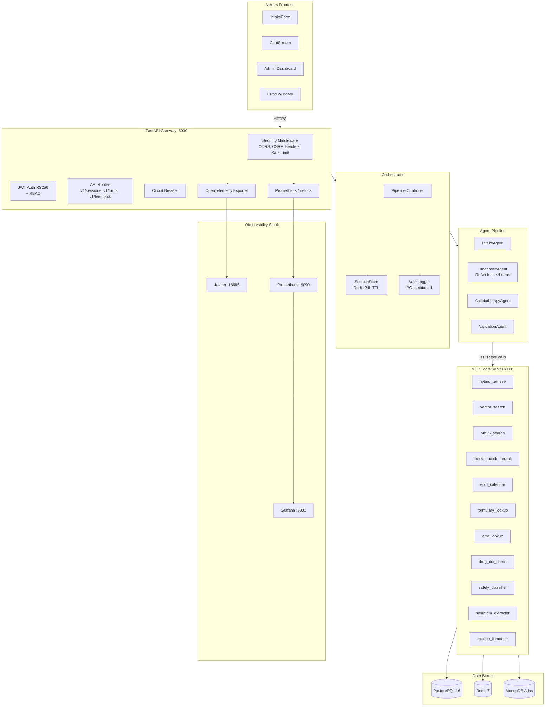
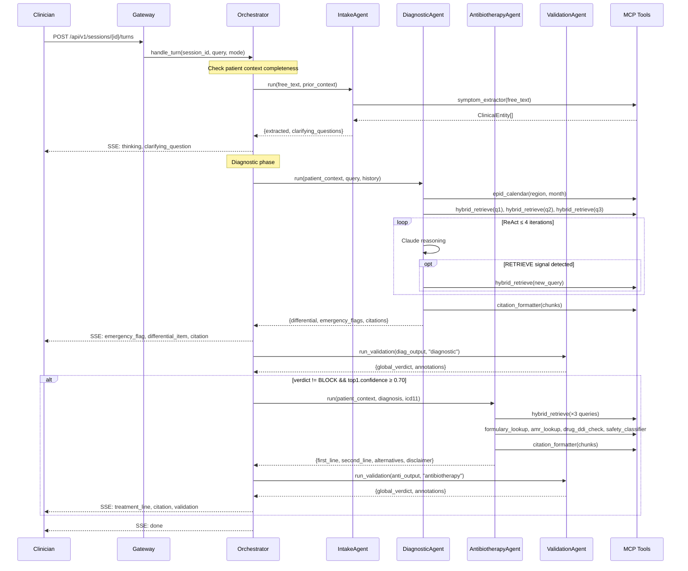

# Design Document — TropiCare Platform Completion

## Overview

This design covers the completion of the TropiCare clinical decision support platform — an AI-powered system for tropical disease diagnosis and antibiotherapy recommendations in Togo. The platform uses a multi-agent pipeline (Intake → Diagnostic → Antibiotherapy → Validation) backed by a hybrid RAG knowledge base (MongoDB Atlas Vector Search + PostgreSQL full-text), with a FastAPI gateway streaming NDJSON events to a Next.js frontend.

The completion work spans 35 requirements across 13 domains: backend restructuring, agent intelligence, authentication, testing, documentation, knowledge base seeding, security hardening, observability, frontend improvements, resilience, performance, edge case handling, and MongoDB migration.

**Key design decisions:**
- Agents communicate via MCP tool calls to the FastMCP server, keeping clinical knowledge tools decoupled from agent logic
- The Orchestrator streams SSE/NDJSON events progressively, enabling real-time rendering of differential diagnoses and treatment plans
- Redis serves as both session store (24h TTL) and cache layer; PostgreSQL is the durable store for audit, users, and knowledge base metadata
- MongoDB Atlas Vector Search handles dense vector search; PostgreSQL handles BM25 sparse search; results are fused via Reciprocal Rank Fusion (RRF) and reranked with a cross-encoder

**Addresses:** Requirements 1–35 (all)

## Architecture

### High-Level System Architecture



**Addresses:** Requirements 1–5 (structure), 22–25 (security/observability), 28–30 (resilience/performance), 35 (MongoDB migration)

### Agent Pipeline Flow



**Addresses:** Requirements 6–12 (agent intelligence), 28 (graceful degradation)

## Components and Interfaces

### 1. Backend Module Structure (Post-Restructuring)

```
backend/
├── app/
│   ├── agents/
│   │   ├── __init__.py          # Re-exports all agents
│   │   ├── base.py              # BaseAgent, AgentSpan, MCPClient only
│   │   ├── intake.py            # IntakeAgent (extracted from base.py)
│   │   ├── diagnostic.py        # DiagnosticAgent (extracted from base.py)
│   │   ├── antibiotherapy.py    # AntibiotherapyAgent (extracted from base.py)
│   │   ├── validation.py        # ValidationAgent (extracted from base.py)
│   │   └── prompts.py           # All prompt templates + formatting helpers
│   ├── config/
│   │   ├── __init__.py
│   │   └── settings.py          # Consolidated Settings (replaces both old configs)
│   ├── gateway/
│   │   ├── __init__.py
│   │   ├── main.py              # FastAPI app, lifespan, routes
│   │   ├── auth.py              # JWT RS256 + RBAC (with missing import fixed)
│   │   ├── middleware.py        # NEW: security headers, CSRF
│   │   ├── circuit_breaker.py   # NEW: circuit breaker for LLM + MCP
│   │   └── routers/
│   │       ├── auth.py          # Registration, login, refresh, logout
│   │       └── analytics.py     # Admin analytics endpoints
│   ├── models/
│   │   ├── __init__.py
│   │   └── schemas.py           # All Pydantic models (consolidated)
│   ├── orchestrator/
│   │   ├── orchestrator.py      # Pipeline controller
│   │   ├── session.py           # Redis session store
│   │   └── audit.py             # Audit logger with PII hashing
│   ├── tools/
│   │   ├── server.py            # FastMCP tool server (MongoDB Atlas Vector Search)
│   │   ├── config.py            # MCP server settings
│   │   ├── db.py                # PG pool + Redis + MongoDB (motor) singletons
│   │   └── embedder.py          # OpenAI embedding client
│   ├── ingestion/               # Document ingestion pipeline (unchanged)
│   └── eval/                    # Evaluation harness (unchanged)
├── requirements/
│   ├── gateway.txt
│   ├── mcp.txt
│   ├── worker.txt
│   └── dev.txt
└── main.py
```

**Files to remove:**
- `backend/app/agents/diagnostic_agent.py` (stub, replaced by diagnostic.py)
- `backend/app/agents/treatment_agent.py` (stub, replaced by antibiotherapy.py)
- `backend/app/agents/resistance_agent.py` (stub, replaced by resistance logic in antibiotherapy.py)
- `backend/app/agents/orchestrator.py` (stub, replaced by orchestrator/orchestrator.py)
- `backend/app/api/routes.py` + `backend/app/api/__init__.py` (duplicate of gateway routes)
- `backend/app/rag/retriever.py` + `backend/app/rag/__init__.py` + `backend/app/rag/ingest.py` (ChromaDB-based, replaced by MongoDB Atlas Vector Search MCP tools)

**Addresses:** Requirements 1–4, 35

### 2. Gateway API Contracts

#### Authentication Endpoints

```
POST /api/v1/auth/register
  Body: { email: string, password: string, role: "clinician" | "admin" }
  Response 201: { user_id: string, email: string }
  Response 409: { detail: "Email already registered" }
  Response 422: { detail: "Password must be ≥10 chars with upper, lower, digit" }

POST /api/v1/auth/login
  Body: { email: string, password: string }
  Response 200: { access_token: string, refresh_token: string, token_type: "bearer" }
  Response 401: { detail: "Invalid credentials" }
  Response 423: { detail: "Account locked — retry in N minutes" }

POST /api/v1/auth/refresh
  Body: { refresh_token: string }
  Response 200: { access_token: string, refresh_token: string }
  Response 401: { detail: "Invalid or expired refresh token" }
```

#### Session & Turn Endpoints (require "clinician" role)

```
POST /api/v1/sessions
  Headers: Authorization: Bearer <jwt>
  Body: { patient_context: PatientContext, language: "fr" | "en" }
  Response 201: { session_id: string }
  Response 429: { detail: "Maximum 5 concurrent sessions" }
  Response 503: { detail: "Session service temporarily unavailable" }
  Rate limit: 30/min

POST /api/v1/sessions/{session_id}/turns
  Headers: Authorization: Bearer <jwt>
  Body: { query: string, mode: "auto" | "diagnostic" | "antibiotherapy" }
  Response 200: NDJSON stream (application/x-ndjson)
  Response 404: { detail: "Session expired or not found" }
  Response 503: { detail: "Session could not be loaded" }
  Rate limit: 60/min

GET /api/v1/sessions/{session_id}
  Response 200: SessionState object
  Response 404: { detail: "Session not found" }

POST /api/v1/feedback
  Body: { turn_id: string, verdict: string, clinician_note?: string, actual_diagnosis?: string }
  Response 201: { status: "accepted" }
```

#### Admin Endpoints (require "admin" role)

```
GET  /api/v1/admin/documents
  Response 200: DocumentSummary[]

POST /api/v1/admin/documents
  Body: multipart/form-data { file, title, source_type, version }
  Response 202: { document_id: string, status: "queued" }

DELETE /api/v1/admin/documents/{doc_id}?reason_id={id}
  Response 204

GET /api/v1/admin/analytics
  Response 200: AnalyticsSummary
```

#### Infrastructure Endpoints (no auth)

```
GET /api/v1/health
  Response 200: { status: "ok", service: "tropicare-gateway" }

GET /metrics
  Response 200: Prometheus text format
```

**Addresses:** Requirements 13–15 (auth), 16 (integration tests), 22–23 (security), 32 (Redis unavailability), 34 (session limits)

### 3. NDJSON Streaming Event Types

The Orchestrator emits one JSON object per line. Event types:

| Event Type | Payload | Phase | Notes |
|---|---|---|---|
| `thinking` | `{ content: string }` | All | Status messages during processing |
| `clarifying_question` | `{ content: string }` | Intake | IntakeAgent requests missing patient context fields |
| `emergency_flag` | `{ flag: { disease, level, action } }` | Diagnostic | MUST precede all `differential_item` events |
| `differential_item` | `{ item: DiagnosisItem }` | Diagnostic | Emitted one per diagnosis for progressive rendering |
| `treatment_line` | `{ tier: string, drug: DrugRegimen }` | Antibiotherapy | Tier: first_line, second_line, alternatives |
| `citation` | `{ citation: Citation }` | Both | Deduplicated by ref_id |
| `validation` | `{ verdict: string, annotations: string[] }` | Both | Verdict: PASS, WARN, or BLOCK |
| `error` | `{ message: string }` | Any | Localized to session language |
| `done` | `{ turn_id: string, partial?: boolean }` | Final | partial=true when awaiting clinician reply |

**Invariant:** `emergency_flag` events MUST precede all `differential_item` events in emission order.

**Addresses:** Requirements 7 (output structure), 12 (clinical alerts), 17.8 (emergency ordering property)

### 4. Security Middleware Stack

Applied in order on every request:

1. **Security Headers Middleware** — Sets `X-Content-Type-Options: nosniff`, `X-Frame-Options: DENY`, `Strict-Transport-Security: max-age=31536000`, `Content-Security-Policy: default-src 'self'` (API responses; frontend may extend CSP for scripts/styles)
2. **CORS Middleware** — Configured origins from `CORS_ORIGINS` env var
3. **CSRF Middleware** — Double-submit cookie pattern for state-changing endpoints from browser clients
4. **Rate Limiter** — slowapi with per-endpoint limits (30/min sessions, 60/min turns, 10/min auth)
5. **JWT Authentication** — RS256 verification via `get_current_user` dependency
6. **RBAC** — `require_role("admin")` / `require_role("clinician")` dependency injection

**Addresses:** Requirements 22–23

### 5. Circuit Breaker Design

```python
class CircuitBreaker:
    """
    States: CLOSED → OPEN → HALF_OPEN → CLOSED
    - CLOSED: requests pass through, failures counted
    - OPEN: requests fail immediately (30s cooldown)
    - HALF_OPEN: single probe request allowed
    
    Config: failure_threshold=5, window_seconds=60, recovery_seconds=30
    """
```

Two instances:
- `llm_breaker` — wraps Anthropic API calls in `BaseAgent._call_claude`
- `mcp_breaker` — wraps `MCPClient.call`

**Addresses:** Requirement 29

### 6. Observability Components

| Component | Implementation | Exports To |
|---|---|---|
| Distributed tracing | `opentelemetry-sdk` + `opentelemetry-exporter-otlp` | Jaeger :4317 |
| Request metrics | `prometheus_client` counters + histograms | Prometheus :9090 |
| Agent latency | Histogram per agent name (p50/p95/p99) | Prometheus |
| Structured logging | `structlog` JSON formatter | stdout → log aggregator |
| Dashboard | Grafana JSON provisioning | Grafana :3001 |

Span hierarchy:
```
gateway.request (trace_id, request_id, session_id)
  └── orchestrator.handle_turn
       ├── agent.intake (latency_ms, tokens_in, tokens_out, verdict)
       ├── agent.diagnostic (latency_ms, tokens_in, tokens_out, verdict)
       │    └── tool.hybrid_retrieve (tool_name, result_count)
       │    └── tool.epid_calendar
       ├── agent.antibiotherapy
       │    └── tool.formulary_lookup
       │    └── tool.amr_lookup
       │    └── tool.drug_ddi_check
       └── agent.validation
```

**Addresses:** Requirements 24–25

### 7. Audit Logger with PII Hashing

The `AuditLogger` will be enhanced to hash patient-identifiable fields before persistence:

```python
PII_FIELDS = ["age_years", "weight_kg", "chief_complaint", "allergies"]

def _anonymize(payload: dict) -> dict:
    """SHA-256 hash PII fields, also hash symptom text entries."""
    result = copy.deepcopy(payload)
    for field in PII_FIELDS:
        if field in result:
            result[field] = hashlib.sha256(str(result[field]).encode()).hexdigest()
    # Hash symptom text entries
    for symptom in result.get("symptoms", []):
        if "text" in symptom:
            symptom["text"] = hashlib.sha256(symptom["text"].encode()).hexdigest()
    return result
```

**Addresses:** Requirement 23.2

### 8. MongoDB Atlas Vector Search Integration

The MCP Tools Server migrates from Qdrant to MongoDB Atlas Vector Search for dense vector retrieval. This section specifies the collection schema, index definition, and connection management.

#### MongoDB Collection Schema: `kb_vectors`

```javascript
{
  _id: ObjectId,                    // MongoDB auto-generated
  chunk_id: String,                 // UUID matching kb_chunks.id in PostgreSQL
  document_id: String,              // UUID matching kb_documents.id in PostgreSQL
  chunk_text: String,               // Full chunk text (denormalized for retrieval)
  embedding: [Number],              // 3072-dimensional float array (text-embedding-3-large)
  section: String,                  // Document section heading
  page: Number,                     // Page number in source document
  language: String,                 // "fr" | "en"
  disease_tags: [String],           // ICD-11 codes
  drug_tags: [String],              // Drug generic names
  content_type: String,             // "guideline" | "formulary" | "amr_data" | "epidemiology"
  superseded: Boolean,              // false by default, true when document is superseded
  source_title: String,             // Denormalized from kb_documents
  source_version: String,           // Denormalized from kb_documents
  source_date: String,              // Denormalized from kb_documents
  created_at: Date                  // Insertion timestamp
}
```

#### Atlas Vector Search Index Definition

```json
{
  "name": "vector_index",
  "type": "vectorSearch",
  "definition": {
    "fields": [
      {
        "type": "vector",
        "path": "embedding",
        "numDimensions": 3072,
        "similarity": "cosine"
      },
      {
        "type": "filter",
        "path": "disease_tags"
      },
      {
        "type": "filter",
        "path": "content_type"
      },
      {
        "type": "filter",
        "path": "language"
      },
      {
        "type": "filter",
        "path": "superseded"
      }
    ]
  }
}
```

#### Connection Management: `backend/app/tools/db.py`

```python
# db.py provides three singletons: PostgreSQL pool, Redis client, MongoDB client
import motor.motor_asyncio as motor

_mongo_client: motor.AsyncIOMotorClient | None = None

async def get_mongo_db() -> motor.AsyncIOMotorDatabase:
    global _mongo_client
    if _mongo_client is None:
        _mongo_client = motor.AsyncIOMotorClient(
            settings.MONGODB_URI,
            maxPoolSize=20,
            minPoolSize=2,
            serverSelectionTimeoutMS=5000,
        )
    return _mongo_client[settings.MONGODB_DB]
```

#### Vector Search Query Pattern

The `vector_search` MCP tool uses the `$vectorSearch` aggregation pipeline stage:

```python
async def vector_search(input: VectorSearchInput) -> list[Chunk]:
    db = await get_mongo_db()
    collection = db["kb_vectors"]

    pipeline = [
        {
            "$vectorSearch": {
                "index": "vector_index",
                "path": "embedding",
                "queryVector": await embed_text(input.query),
                "numCandidates": input.k * 10,
                "limit": input.k,
                "filter": {
                    "superseded": {"$eq": False},
                    **({"disease_tags": {"$in": input.disease_tags}} if input.disease_tags else {}),
                    **({"content_type": {"$eq": input.content_type}} if input.content_type else {}),
                    **({"language": {"$eq": input.language}} if input.language else {}),
                },
            }
        },
        {"$addFields": {"score": {"$meta": "vectorSearchScore"}}},
    ]

    results = await collection.aggregate(pipeline).to_list(length=input.k)
    return [Chunk(**r, chunk_id=str(r["_id"])) for r in results]
```

#### Ingestion Pipeline MongoDB Storage

The `upsert_chunks` function in `ingestion/store.py` inserts into MongoDB instead of Qdrant:

```python
async def upsert_chunks(document_id, chunks, pg_pool, mongo_db, collection="kb_vectors"):
    coll = mongo_db[collection]
    for chunk in chunks:
        # Insert into PostgreSQL (metadata + BM25 index) — unchanged
        # Insert into MongoDB (vector + denormalized metadata)
        await coll.update_one(
            {"chunk_id": chunk_id},
            {"$set": {
                "chunk_id": chunk_id,
                "document_id": document_id,
                "embedding": chunk["vector"],
                "chunk_text": chunk["chunk_text"],
                # ... all metadata fields
                "superseded": False,
            }},
            upsert=True,
        )
```

#### Docker Compose Changes

- Remove: `qdrant` service, `qdrant-init` service, `qdrant_data` volume
- Remove: `QDRANT_URL` and `QDRANT_COLLECTION` from `x-common-env`
- Add: `MONGODB_URI` and `MONGODB_DB` to `x-common-env`
- Add: MongoDB service for local development (production uses Atlas cloud):

```yaml
mongodb:
  image: mongo:7-jammy
  restart: unless-stopped
  command: ["--replSet", "rs0", "--bind_ip_all"]
  volumes:
    - mongo_data:/data/db
  ports:
    - "27017:27017"
  healthcheck:
    test: ["CMD", "mongosh", "--eval", "rs.status()"]
    interval: 10s
    timeout: 5s
    retries: 10
```

Note: A replica set is required for Atlas Vector Search compatibility in local development. An init container runs `rs.initiate()` on first startup.

**Addresses:** Requirement 35

### 9. Frontend Components

#### ErrorBoundary

A class component wrapping all route-level pages. On error, renders a localized fallback with retry button. Logs error details to console and optionally to a reporting endpoint.

#### Loading States

All data-dependent components show skeleton/spinner while API requests or streaming operations are in progress. The `useStream` hook already manages `isStreaming` state; components like `ChatStream` already show `ThinkingIndicator`.

#### Accessibility

- All interactive elements get `aria-label` attributes
- Semantic HTML landmarks: `<main>`, `<nav>`, `<header>`
- `EmergencyBanner` already uses `role="alert"`
- Fix `chat/page.tsx` type mismatch: `onComplete` callback accepts `PatientContext` instead of `Record<string, unknown>`

**Addresses:** Requirements 26–27

## Data Models

### Backend Pydantic Models (consolidated schemas.py)

```python
# ── Patient Context ──────────────────────────────────────────
class LabResult(BaseModel):
    name: str
    value: str
    unit: str

class Medication(BaseModel):
    name: str
    dose: str
    frequency: str

class VitalSigns(BaseModel):
    temp_c: float | None = None
    bp_systolic: int | None = None
    bp_diastolic: int | None = None
    hr: int | None = None
    rr: int | None = None
    spo2: int | None = None
    gcs: int | None = None

class Symptom(BaseModel):
    text: str
    normalized: str | None = None
    snomed_code: str | None = None

class PatientContext(BaseModel):
    age_years: int
    sex: Literal["M", "F"]
    weight_kg: float | None = None
    region: str  # Maritime | Plateaux | Centrale | Kara | Savanes
    chief_complaint: str
    symptoms: list[Symptom] = []
    vital_signs: VitalSigns | None = None
    lab_results: list[LabResult] = []
    current_medications: list[Medication] = []
    allergies: list[str] = []
    pregnancy_status: str = "not_applicable"
    symptom_onset_days: int | None = None
    travel_history: list[str] = []

# ── Diagnostic Output ────────────────────────────────────────
class ConfirmatoryTest(BaseModel):
    name: str
    priority: Literal["urgent", "standard", "optional"]
    availability_togo: Literal["disponible", "limité", "indisponible"]
    interpretation: str | None = None

class DiagnosisItem(BaseModel):
    rank: int
    disease_name: str
    icd11_code: str
    confidence: float = Field(ge=0.0, le=1.0)
    supporting_evidence: list[str]
    against_evidence: list[str] = []
    confirmatory_tests: list[ConfirmatoryTest] = []
    red_flags: list[str] = []
    citations: list[int] = []

class EmergencyFlag(BaseModel):
    disease: str
    level: Literal["critical", "urgent"]
    action: str

class DiagnosticDifferential(BaseModel):
    emergency_flags: list[EmergencyFlag] = []
    differential: list[DiagnosisItem]
    clarifying_questions: list[str] = []
    reasoning_summary: str = ""
    citations: list[dict] = []

# ── Treatment Output ─────────────────────────────────────────
class DrugRegimen(BaseModel):
    drug_name: str
    generic_name: str
    came_available: bool
    dose: str
    dose_mg_per_kg: str | None = None
    route: Literal["PO", "IV", "IM", "SC", "topique"]
    frequency: str
    duration_days: int
    pregnancy_class: str | None = None
    ddi_warnings: list[str] = []
    amr_note: str | None = None
    monitoring: list[str] = []
    citations: list[int] = []

class Contraindication(BaseModel):
    drug: str
    reason: str

class TreatmentPlan(BaseModel):
    target_disease: str
    clinical_rationale: str
    first_line: list[DrugRegimen]
    second_line: list[DrugRegimen] = []
    alternatives: list[DrugRegimen] = []
    contraindicated: list[Contraindication] = []
    supportive_care: list[str] = []
    follow_up_guidance: str = ""
    referral_criteria: str = ""
    disclaimer: str  # Mandatory regulatory disclaimer

# ── AMR / DDI / Safety (mirroring MCP tool types) ───────────
class AMRProfile(BaseModel):
    drug: str
    pathogen: str
    region: str
    resistance_pct: float | None
    data_source: str
    year: int | None
    confidence: Literal["high", "medium", "low", "no_data"]
    recommendation: str

class DDIWarning(BaseModel):
    drug_a: str
    drug_b: str
    severity: Literal["contraindicated", "major", "moderate", "minor"]
    mechanism: str
    clinical_effect: str
    management: str

# ── Consultation Response (full pipeline output) ─────────────
class ConsultationResponse(BaseModel):
    diagnostic: DiagnosticDifferential
    treatments: list[TreatmentPlan] = []
    warnings: list[str] = []
    references: list[dict] = []

# ── Admin Analytics ──────────────────────────────────────────
class AnalyticsSummary(BaseModel):
    total_sessions: int
    total_turns: int
    avg_latency_ms: float
    top_diagnoses: list[dict]          # [{disease_name, count, avg_confidence}]
    emergency_rate: float              # fraction of turns with emergency flags
    feedback_summary: dict             # {correct: int, partial: int, incorrect: int}
    active_users_24h: int
    cache_hit_rate: float
    period_start: str                  # ISO 8601 date
    period_end: str                    # ISO 8601 date
```

### Database Schema (existing, from migration 0001)

| Table | Purpose | Key Columns |
|---|---|---|
| `users` | Clinician/admin accounts | id (UUID), email, hashed_pw, roles[], active |
| `sessions` | Consultation sessions | id (UUID), user_id (FK), patient_context (JSONB), language |
| `turns` | Individual query/response pairs | id (UUID), session_id (FK), query, response (JSONB), agent_trace, latency_ms |
| `kb_documents` | Knowledge base document metadata | id (UUID), title, source_type, version, superseded_by |
| `kb_chunks` | Document chunks with FTS index | id (UUID), document_id (FK), chunk_text, section, disease_tags[], content_hash |
| `came_formulary` | CAME Togo drug availability | generic_name, atc_code, available, dosage_forms[] |
| `amr_data` | Antimicrobial resistance profiles | drug, pathogen, region, resistance_pct, confidence |
| `ddi_interactions` | Drug-drug interactions | drug_a, drug_b, severity, mechanism, clinical_effect |
| `drug_safety` | Pregnancy/lactation safety | drug, pregnancy_category, lactation_safe, t1/t2/t3_notes |
| `audit_log` | Immutable audit trail (partitioned) | event_type, session_id, turn_id, payload (JSONB) |
| `feedback` | Clinician feedback on turns | turn_id, verdict, clinician_note, actual_diagnosis |

#### MongoDB Collection

| Collection | Purpose | Key Fields |
|---|---|---|
| `kb_vectors` | Vector embeddings for Atlas Vector Search | chunk_id, document_id, embedding (3072-dim), chunk_text, disease_tags[], content_type, superseded |

### Frontend TypeScript Types (consolidated lib/types.ts)

```typescript
// Mirrors backend PatientContext
export interface PatientContext {
  age_years: number
  sex: "M" | "F"
  weight_kg: number | null
  region: string
  chief_complaint: string
  symptoms: { text: string; normalized?: string }[]
  vital_signs?: Partial<VitalSigns>
  lab_results: { name: string; value: string; unit: string }[]
  current_medications: { name: string; dose: string; frequency: string }[]
  allergies: string[]
  pregnancy_status: string
  symptom_onset_days: number | null
  travel_history: string[]
}

export interface DiagnosisItem {
  rank: number
  disease_name: string
  icd11_code: string
  confidence: number
  supporting_evidence: string[]
  confirmatory_tests: { name: string; priority: string; availability_togo: string }[]
  red_flags: string[]
  citations: number[]
}

export interface EmergencyFlag {
  disease: string
  level: "critical" | "urgent"
  action: string
}

export interface DrugRegimen {
  drug_name: string
  generic_name: string
  came_available: boolean
  dose: string
  route: string
  frequency: string
  duration_days: number
  pregnancy_class?: string
  ddi_warnings: string[]
  amr_note?: string
  monitoring: string[]
  citations: number[]
}

export interface TreatmentPlanData {
  target_disease: string
  clinical_rationale: string
  first_line: DrugRegimen[]
  second_line: DrugRegimen[]
  alternatives: DrugRegimen[]
  disclaimer: string
}

export interface Citation {
  ref_id: number
  source_title: string
  section: string
  page: number
  version: string
  date: string
  chunk_snippet: string
}

export type SSEEvent =
  | { type: "thinking"; content: string }
  | { type: "clarifying_question"; content: string }
  | { type: "emergency_flag"; flag: EmergencyFlag }
  | { type: "differential_item"; item: DiagnosisItem }
  | { type: "treatment_line"; tier: string; drug: DrugRegimen }
  | { type: "citation"; citation: Citation }
  | { type: "validation"; verdict: string; annotations: string[] }
  | { type: "error"; message: string }
  | { type: "done"; turn_id: string; partial?: boolean }
```

**Addresses:** Requirements 3 (models consolidation), 4 (frontend types), 7 (diagnostic output structure), 10 (treatment output)


## Correctness Properties

*A property is a characteristic or behavior that should hold true across all valid executions of a system — essentially, a formal statement about what the system should do. Properties serve as the bridge between human-readable specifications and machine-verifiable correctness guarantees.*

### Property 1: PatientContext serialization round-trip

*For any* valid PatientContext object (with arbitrary age, sex, weight, region, symptoms, vital signs, lab results, medications, allergies, pregnancy status, onset days, and travel history), serializing to JSON and deserializing back SHALL produce an object equivalent to the original.

**Validates: Requirements 3.3, 17.4**

### Property 2: Diagnostic output structural invariants

*For any* valid DiagnosticDifferential output, every DiagnosisItem in the differential list SHALL have a non-empty disease_name, a non-empty icd11_code, a confidence score within [0.0, 1.0], at least one supporting_evidence string, and confirmatory_tests where each test has an availability_togo value in {"disponible", "limité", "indisponible"}.

**Validates: Requirements 7.1, 7.2, 7.3, 17.6**

### Property 3: Emergency flag ordering invariant

*For any* streaming event sequence produced by the Orchestrator, all emergency_flag events SHALL precede all differential_item events in emission order.

**Validates: Requirements 7.4, 17.8**

### Property 4: Treatment disclaimer invariant

*For any* valid TreatmentPlan output produced by the AntibiotherapyAgent, the disclaimer field SHALL be present and SHALL contain the mandatory regulatory disclaimer text starting with "⚠️ AIDE À LA DÉCISION UNIQUEMENT".

**Validates: Requirements 10.4, 17.7**

### Property 5: Citation deduplication invariant

*For any* ConsultationResponse produced by the Orchestrator, the references list SHALL contain no duplicate entries when compared by the tuple (source_title, section).

**Validates: Requirements 12.4, 17.9**

### Property 6: High-resistance drug exclusion from first-line

*For any* treatment plan where AMR data indicates resistance above 30% for a drug in the patient's region, that drug SHALL NOT appear in the first_line list of the TreatmentPlan output.

**Validates: Requirement 9.3**

### Property 7: Pregnancy safety filtering

*For any* treatment plan generated for a patient with pregnancy_status indicating pregnancy (pregnant_t1, pregnant_t2, or pregnant_t3), all drugs in first_line, second_line, and alternatives SHALL have a pregnancy_class of "A", "B", or "C" (never "D" or "X").

**Validates: Requirement 10.2**

### Property 8: Password validation rejects weak passwords

*For any* password string that is shorter than 10 characters, or lacks an uppercase letter, or lacks a lowercase letter, or lacks a digit, the registration endpoint SHALL reject the request with a validation error.

**Validates: Requirement 13.3**

### Property 9: Diagnostic output parser correctness

*For any* raw string output from the LLM in response to a diagnostic query, the parser SHALL either produce a result conforming to the DiagnosticDifferential schema (with a non-empty differential list) or raise a structured ValueError — never silently produce malformed output.

**Validates: Requirement 17.5**

### Property 10: Security headers on every response

*For any* HTTP request to the Gateway (authenticated or not, any method, any path), the response SHALL include headers X-Content-Type-Options: nosniff, X-Frame-Options: DENY, Strict-Transport-Security: max-age=31536000, and Content-Security-Policy: default-src 'self'.

**Validates: Requirements 22.1, 22.2, 22.3, 22.4**

### Property 11: PII hashing in audit logs

*For any* audit log entry written by the AuditLogger that contains patient-identifiable fields (age_years, weight_kg, chief_complaint, symptom text, allergies), those field values SHALL be replaced with their SHA-256 hashes before persistence to the audit_log table.

**Validates: Requirement 23.2**

### Property 12: Session conversation history bounded

*For any* session in the SessionStore, after appending a turn, the conversation_history list SHALL contain at most 20 entries, with the oldest entries discarded first.

**Validates: Requirement 30.2**

## Error Handling

### Agent-Level Error Handling

| Error Scenario | Handler | Behavior | Requirement |
|---|---|---|---|
| MCP tool call fails | `BaseAgent._execute` try/except | Log warning, continue with available data, add warning annotation | Req 28.1 |
| LLM returns invalid JSON | `DiagnosticAgent._parse_output` | Retry LLM call once; if still invalid, return structured error event | Req 8.1 |
| LLM returns partial JSON | `BaseAgent._extract_json` | Extract valid JSON fields, discard malformed, emit validation warning | Req 28.2 |
| All agent retries exhausted | `Orchestrator.handle_turn` except block | Return `{"type": "error", "message": "..."}` in session language | Req 28.3 |
| Circuit breaker open (LLM) | `CircuitBreaker` wrapper | Return 503 immediately for 30s, then probe | Req 29.1 |
| Circuit breaker open (MCP) | `CircuitBreaker` wrapper | Return 503 immediately for 30s, then probe | Req 29.3 |

### Infrastructure Error Handling

| Error Scenario | Handler | Behavior | Requirement |
|---|---|---|---|
| MongoDB Atlas Vector Search unreachable | `vector_search` try/except | Fall back to BM25-only retrieval, log error, add warning annotation | Req 31.1, 31.2 |
| MongoDB connection pool exhausted | `get_mongo_db` | Log warning, retry with backoff; if persistent, fall back to BM25-only retrieval | Req 31.1, 35.2 |
| Redis unreachable (session create) | `create_session` route | Return HTTP 503 "Session service temporarily unavailable" | Req 32.1 |
| Redis unreachable (turn submit) | `submit_turn` route | Return HTTP 503 "Session could not be loaded" | Req 32.2 |
| Session expired/not found | `submit_turn` route | Return HTTP 404 "Session expired — create new session" | Req 34.1 |
| Concurrent session limit exceeded | `create_session` route | Return HTTP 429 "Maximum 5 concurrent sessions" | Req 34.2 |
| Empty KB (no chunks returned) | Diagnostic/Treatment agents | Add warning annotation "No KB evidence found — based on LLM general knowledge" | Req 33.1, 33.2 |

### Authentication Error Handling

| Error Scenario | Handler | Behavior | Requirement |
|---|---|---|---|
| Expired/malformed JWT | `get_current_user` | Return HTTP 401 with descriptive message | Req 14.3 |
| Insufficient role | `require_role` | Return HTTP 403 "Rôle insuffisant" | Req 15.1, 15.2 |
| Account locked (5 failures) | Login route | Return HTTP 423 "Account locked — retry in N minutes" | Req 14.4 |
| Duplicate email registration | Register route | Return HTTP 409 "Email already registered" | Req 13.2 |
| Rate limit exceeded | slowapi middleware | Return HTTP 429 with retry-after header | Req 23.3 |

### Frontend Error Handling

- `ErrorBoundary` class component wraps all route-level pages, catches rendering errors, displays localized fallback with retry button (Req 26.1, 26.2)
- `useStream` hook catches fetch errors and AbortError, sets `error` state for display (existing behavior)
- Loading skeletons/spinners shown during all async operations (Req 27.1)

## Testing Strategy

### Test Organization

```
tests/
├── unit/
│   ├── agents/
│   │   ├── test_diagnostic_agent.py
│   │   ├── test_antibiotherapy_agent.py
│   │   ├── test_intake_agent.py
│   │   ├── test_validation_agent.py
│   │   └── test_base_agent.py
│   ├── tools/
│   │   ├── test_vector_search.py
│   │   ├── test_formulary_lookup.py
│   │   ├── test_amr_lookup.py
│   │   └── test_hybrid_retrieve.py
│   └── models/
│       └── test_schemas.py
├── integration/
│   ├── api/
│   │   ├── test_sessions.py
│   │   ├── test_turns.py
│   │   ├── test_feedback.py
│   │   ├── test_auth.py
│   │   └── test_admin.py
│   └── orchestrator/
│       └── test_orchestrator.py
├── property/
│   ├── test_patient_context_roundtrip.py
│   ├── test_diagnostic_invariants.py
│   ├── test_treatment_invariants.py
│   ├── test_event_ordering.py
│   ├── test_security_headers.py
│   ├── test_password_validation.py
│   ├── test_audit_pii_hashing.py
│   └── test_session_history_bound.py
└── conftest.py

frontend/__tests__/
├── components/
│   ├── IntakeForm.test.tsx
│   ├── ChatStream.test.tsx
│   └── EmergencyBanner.test.tsx
└── hooks/
    └── useStream.test.ts
```

### Dual Testing Approach

**Unit tests** verify specific examples, edge cases, and error conditions:
- Agent unit tests mock MCP tool calls and Claude API, verify output structure (Req 16.1–16.3)
- Integration tests verify Gateway endpoints with test database (Req 16.4–16.7)
- Frontend component tests verify rendering and interaction (Req 17.1–17.3)

**Property-based tests** verify universal properties across all inputs:
- Library: **Hypothesis** (Python) for backend properties
- Library: **fast-check** (TypeScript) for frontend properties (PatientContext round-trip)
- Minimum 100 iterations per property test
- Each test tagged with: `Feature: tropicare-platform-completion, Property {N}: {title}`

### Property Test Implementation Plan

| Property | Test File | Generator Strategy |
|---|---|---|
| P1: PatientContext round-trip | `test_patient_context_roundtrip.py` | Hypothesis `@given` with `builds(PatientContext)` using constrained strategies for each field |
| P2: Diagnostic structural invariants | `test_diagnostic_invariants.py` | Generate random `DiagnosticDifferential` objects, verify field constraints |
| P3: Emergency ordering | `test_event_ordering.py` | Generate random lists of SSE events including emergency_flag and differential_item, pass through ordering logic, verify invariant |
| P4: Disclaimer invariant | `test_treatment_invariants.py` | Generate random `TreatmentPlan` objects via AntibiotherapyAgent._parse_output, verify disclaimer |
| P5: Citation deduplication | `test_treatment_invariants.py` | Generate random citation lists with duplicates, pass through deduplication, verify uniqueness |
| P6: High-resistance exclusion | `test_treatment_invariants.py` | Generate random AMR profiles with >30% resistance, verify excluded from first_line |
| P7: Pregnancy safety | `test_treatment_invariants.py` | Generate random treatment plans for pregnant patients, verify no D/X drugs |
| P8: Password validation | `test_password_validation.py` | Generate random strings missing required character classes, verify rejection |
| P9: Parser correctness | `test_diagnostic_invariants.py` | Generate random strings (valid JSON, invalid JSON, partial JSON), verify parser behavior |
| P10: Security headers | `test_security_headers.py` | Generate random valid HTTP requests, verify all responses contain required headers |
| P11: PII hashing | `test_audit_pii_hashing.py` | Generate random audit payloads with PII fields, verify SHA-256 hashing |
| P12: Session history bound | `test_session_history_bound.py` | Generate random session histories with >20 turns, verify truncation to 20 |

### Evaluation Framework Testing

The existing `EvalHarness` (Req 18) runs benchmark cases end-to-end:
- Creates sessions, submits turns, collects NDJSON streams
- Computes top-1/3/5 accuracy, MRR, emergency recall, citation rate, guideline adherence, CAME coverage, disclaimer rate
- Generates `BenchmarkReport` with per-category and per-difficulty breakdowns
- LLM judges sample 20% of results for citation quality and hallucination detection

### pytest Configuration

```ini
# pyproject.toml
[tool.pytest.ini_options]
testpaths = ["tests"]
markers = [
    "unit: Unit tests with mocked dependencies",
    "integration: Integration tests requiring database/Redis",
    "property: Property-based tests (Hypothesis, ≥100 iterations)",
    "slow: Tests that take >10s",
]
asyncio_mode = "auto"
```
