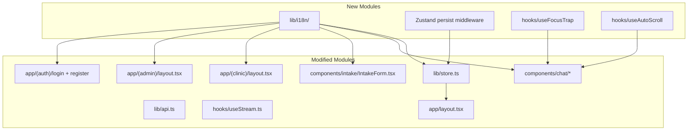

# Design Document: UI/UX Improvements

## Overview

This design covers a comprehensive set of UI/UX improvements to the TropiCare frontend — a clinical decision support system built with Next.js 14+ (App Router), React 19, TypeScript, Tailwind CSS 4.2, and Zustand. The improvements span seven domains:

1. **Accessibility** — Focus traps, ARIA attributes, screen reader announcements, keyboard navigation
2. **Form UX** — Inline validation, responsive grids, submission preview, tag editor hints
3. **Streaming & Chat** — Expandable reasoning, conversation history, keyboard shortcuts, auto-scroll
4. **Error Handling** — Consistent API client usage, friendly streaming errors, retry patterns
5. **Navigation & Layout** — Responsive sidebar, breadcrumbs, admin link visibility, responsive pages
6. **State Management** — Zustand persist middleware with split storage, dismissed alerts persistence
7. **Internationalization** — Custom lightweight i18n system with `useTranslation` hook, server-side language detection

The design prioritizes zero new runtime dependencies (devDependencies like `fast-check` for testing are acceptable), progressive enhancement for mobile/tablet, and WCAG 2.1 AA compliance for all interactive elements.

## Architecture

The improvements layer onto the existing architecture without changing the fundamental data flow:



### Key Architectural Decisions

1. **Custom i18n over library**: The app has ~200 translatable strings across two languages. A custom solution with static dictionaries and a `useTranslation` hook avoids the bundle size and complexity of `next-intl` or `react-i18next`. Dictionaries are plain TypeScript objects with dot-notation keys, enabling tree-shaking and type safety.

2. **Split storage for Zustand persist**: Auth tokens go to `sessionStorage` (cleared on tab close, limiting XSS exposure). Preferences (language, dismissed alerts) go to `localStorage` (survive tab close). Two separate persist configurations on the same store.

3. **Focus trap as a custom hook**: `useFocusTrap(ref, isOpen)` — a reusable hook that handles Tab/Shift+Tab cycling, Escape to close, and initial focus. Used by CitationDrawer, summary preview modal, and responsive sidebar overlay.

4. **Conversation history via accumulated turns in useStream**: Rather than a separate history store, `useStream` accumulates `Turn[]` where each turn holds its own differential, treatment, citations, etc. The ChatStream renders all turns sequentially.

5. **Server-side language detection for login page**: Since the login page is a Server Component, it reads language from a cookie (`tropicare-lang`) set by the client-side language toggle. Falls back to `fr`.

## Components and Interfaces

### New Components

#### `lib/i18n/index.ts` — I18n System
```typescript
// Translation dictionaries
type TranslationDict = Record<string, string | Record<string, string>>

// Flattened key-value map for dot-notation lookup
type FlatDict = Record<string, string>

interface I18nModule {
  t: (key: string, params?: Record<string, string | number>) => string
  locale: "fr" | "en"
}

// React hook
function useTranslation(): I18nModule
// Server-side helper (reads cookie, returns t function)
function getServerTranslation(cookieValue?: string): I18nModule
```

#### `lib/i18n/fr.ts` and `lib/i18n/en.ts` — Translation Dictionaries
```typescript
// Flat key-value structure with dot-notation keys
export const fr: Record<string, string> = {
  "nav.consultation": "Consultation",
  "nav.history": "Historique",
  "nav.logout": "Déconnexion",
  "chat.placeholder": "Décrivez le tableau clinique ou posez une question…",
  "chat.send": "Envoyer",
  "chat.stop": "Arrêter",
  "chat.submitHint": "Ctrl+Entrée pour envoyer",
  "chat.scrollToBottom": "Défiler vers le bas",
  "chat.sending": "Envoi en cours…",
  "chat.thinking": "Analyse en cours",
  "chat.differential": "Diagnostic différentiel",
  "chat.treatmentPlan": "Plan thérapeutique",
  "citation.title": "Sources",
  "citation.search": "Rechercher dans les sources…",
  "citation.count": "{{matched}} / {{total}} sources",
  "citation.close": "Fermer le panneau des sources",
  // ... ~200 keys total
}
```

#### `hooks/useFocusTrap.ts`
```typescript
function useFocusTrap(
  containerRef: RefObject<HTMLElement>,
  isActive: boolean,
  onEscape?: () => void
): void
```
Constrains Tab/Shift+Tab within `containerRef` when `isActive` is true. Calls `onEscape` on Escape key. Sets initial focus to first focusable element.

#### `hooks/useAutoScroll.ts`
```typescript
function useAutoScroll(
  containerRef: RefObject<HTMLElement>,
  dependencies: unknown[]
): {
  isAtBottom: boolean
  scrollToBottom: () => void
}
```
Auto-scrolls container when dependencies change, unless user has manually scrolled up. Returns state for "scroll to bottom" button visibility. The hook considers the user "at bottom" when `scrollTop + clientHeight >= scrollHeight - 50` (50px threshold to account for minor layout shifts). A `scroll` event listener updates `isAtBottom` on every user scroll. Auto-scroll only fires when `isAtBottom` is true.

#### `components/ui/Breadcrumb.tsx`
```typescript
interface BreadcrumbItem {
  label: string
  href?: string
}
function Breadcrumb({ items }: { items: BreadcrumbItem[] }): JSX.Element
```
Renders `<nav aria-label="Fil d'Ariane">` with `<ol>` and `aria-current="page"` on the last item. Items are passed as props from each layout. The clinic and admin layouts derive items from `usePathname()` combined with a static route-to-label mapping (e.g., `{ "/chat": "nav.consultation", "/sessions": "nav.history", "/admin/knowledge-base": "admin.knowledgeBase" }`). Labels are resolved via `useTranslation`.

#### `components/ui/SkipLink.tsx`
```typescript
function SkipLink(): JSX.Element
```
Visually hidden anchor that becomes visible on focus, linking to `#main-content`. Both the clinic layout and admin layout must add `id="main-content"` to their `<main>` element for the skip link target to work.

#### `components/intake/SummaryPreview.tsx`
```typescript
interface SummaryPreviewProps {
  context: PatientContext
  onConfirm: () => void
  onEdit: () => void
}
function SummaryPreview(props: SummaryPreviewProps): JSX.Element
```
Modal overlay with focus trap showing all entered patient data. "Confirmer" and "Modifier" buttons.

### Modified Components

#### `lib/store.ts` — Zustand Store with Persist
```typescript
// Added fields
interface AppStore {
  // ... existing fields ...
  dismissedAlerts: string[]          // disease names
  dismissAlert: (disease: string) => void
  clearDismissedAlerts: () => void
}

// Two persist partials:
// 1. sessionStorage: { user, token }
// 2. localStorage: { language, session, dismissedAlerts }

// The setLanguage action must also set a cookie:
//   document.cookie = `tropicare-lang=${lang}; path=/; SameSite=Lax; max-age=31536000`
// This cookie is read by the login/register Server Components
// for server-side language detection (see getServerTranslation).
```

#### `hooks/useStream.ts` — Conversation History
```typescript
interface Turn {
  query: string
  thinking: string[]
  emergencies: EmergencyFlag[]
  differential: DiagnosisItem[]
  treatment: Partial<TreatmentPlanData> & {
    first_line: DrugRegimen[]
    second_line: DrugRegimen[]
    alternatives: DrugRegimen[]
  }
  citations: Citation[]
  annotations: string[]
  turnId: string | null
  error: string | null
}

interface StreamState {
  turns: Turn[]           // accumulated history
  currentTurn: Turn       // in-progress turn
  isStreaming: boolean
  lastQuery: string | null // stored for retry on error
}
```
The `send` callback stores the query text in `lastQuery` before streaming begins. A new `retry` callback re-invokes `send(lastQuery)` when the user clicks the retry button after a streaming error.

#### `components/chat/CitationDrawer.tsx`
- Add backdrop overlay (`fixed inset-0 bg-black/30`)
- Add `role="dialog"`, `aria-modal="true"`
- Integrate `useFocusTrap`
- Add search input with filter logic
- Display match count

#### `components/chat/ChatStream.tsx`
- Render all `state.turns` with dividers
- Swap Enter/Ctrl+Enter behavior
- Add submit hint text
- Add auto-scroll via `useAutoScroll`
- Add "scroll to bottom" button
- Add loading state before first stream event
- Read `dismissedAlerts` from store
- Add `aria-live="polite"` region for dismissal announcements
- Use `useTranslation` for all strings

#### `components/chat/DifferentialCard.tsx`
- Add `aria-expanded` to toggle button
- Replace text chevrons with CSS chevron + `aria-hidden`
- Add `role="meter"`, `aria-valuemin`, `aria-valuemax`, `aria-valuenow`, `aria-label` to confidence bar
- Responsive: wrap confidence bar below name on mobile

#### `components/chat/EmergencyBanner.tsx`
- Use `useTranslation` for labels

#### `components/chat/ThinkingIndicator.tsx`
- Show all lines in scrollable container (max-h-[200px])
- Add expand toggle to remove height constraint
- Auto-scroll to bottom on new lines

#### `components/chat/TreatmentPlan.tsx`
- Active tab badge: `bg-blue-600 text-white` vs inactive `bg-muted`
- Unavailable drug tooltip with `aria-describedby`
- Responsive dosage grid: 1 col on mobile
- Use `useTranslation` for all labels

#### `components/chat/FeedbackPanel.tsx`
- Replace raw `fetch` with `api.feedback.submit`
- Add error state with retry button

#### `components/intake/IntakeForm.tsx`
- Inline validation on blur with `aria-describedby` and `aria-invalid`
- Section: `aria-expanded`, `aria-controls`, CSS chevron
- TagEditor: helper text with `aria-describedby`
- Vital signs: responsive grid (2/3/4 cols)
- Mandatory fields: responsive grid (1/2/3 cols)
- Summary preview modal before submission
- Use `useTranslation` for all strings

#### `app/layout.tsx` — Dynamic lang Attribute
```typescript
// Client component wrapper that reads language from store
// and sets document.documentElement.lang via useEffect.
// Must be a "use client" component rendered as a child of the
// Server Component root layout, since the root layout renders
// <html lang="fr"> statically and cannot use hooks.
function LangUpdater(): null {
  const { language } = useAppStore()
  useEffect(() => {
    document.documentElement.lang = language
  }, [language])
  return null
}
```

#### `app/(auth)/login/page.tsx` and `register/page.tsx`
- Remove `<html>` and `<body>` tags
- Replace inline styles with Tailwind classes
- Read language from cookie for server-side translation
- Responsive: full-width on mobile

#### `app/(clinic)/layout.tsx`
- Responsive sidebar: hidden below md, hamburger button (inline SVG 3-bar icon, 24x24, `aria-hidden="true"` on the SVG since the button has `aria-label`), overlay with backdrop
- Sidebar overlay uses `transition-transform duration-300 ease-in-out` for slide-in animation (`-translate-x-full` when closed, `translate-x-0` when open)
- Skip-to-content link as first child
- `<main id="main-content">` for skip link target
- Admin link for admin-role users
- Breadcrumb component derived from `usePathname()` + route-to-label map
- Use `useTranslation`
- Sessions page: import both `fr` and `en` locales from `date-fns/locale` and select based on active language for `formatRelative`

#### `app/(admin)/layout.tsx`
- Same responsive sidebar pattern (hamburger SVG icon, `transition-transform duration-300 ease-in-out` slide-in)
- Skip-to-content link as first child
- `<main id="main-content">` for skip link target
- Breadcrumb component derived from `usePathname()` + route-to-label map
- Use `useTranslation`

#### `app/globals.css`
- Add focus-visible ring utility
- Add skip-link styles

## Data Models

### Translation Dictionary Structure
```typescript
// lib/i18n/types.ts
type Locale = "fr" | "en"
type TranslationKey = string  // dot-notation, e.g. "chat.send"
type TranslationDict = Record<TranslationKey, string>

// Interpolation: "{{count}} sources" + { count: 3 } → "3 sources"
```

### Zustand Store Persist Shape
```typescript
// sessionStorage key: "tropicare-auth"
interface AuthPersist {
  user: User | null
  token: string | null
}

// localStorage key: "tropicare-prefs"
interface PrefsPersist {
  language: "fr" | "en"
  session: SessionMeta | null
  dismissedAlerts: string[]
}
```

### Conversation Turn Model
```typescript
// Single canonical definition — also used by hooks/useStream.ts
interface Turn {
  query: string
  thinking: string[]
  emergencies: EmergencyFlag[]
  differential: DiagnosisItem[]
  treatment: Partial<TreatmentPlanData> & {
    first_line: DrugRegimen[]
    second_line: DrugRegimen[]
    alternatives: DrugRegimen[]
  }
  citations: Citation[]
  annotations: string[]
  turnId: string | null
  error: string | null
}
```

### Inline Validation Error Model
```typescript
// Per-field error tracking in IntakeForm
// Covers all required fields validated in the existing handleSubmit logic
type FieldErrors = Partial<Record<
  "age" | "sex" | "region" | "complaint",
  string  // localized error message
>>

// Validation rules (preserved from existing code):
// - age: required, must be a valid number >= 0
// - sex: required, must be "M" or "F"
// - region: required, must be non-empty
// - complaint: required, must be non-empty after trim
// Inline validation triggers on blur; form submission is blocked if any FieldErrors are non-empty
```


## Correctness Properties

*A property is a characteristic or behavior that should hold true across all valid executions of a system — essentially, a formal statement about what the system should do. Properties serve as the bridge between human-readable specifications and machine-verifiable correctness guarantees.*

### Property 1: Section aria-expanded reflects open state

*For any* Section component instance and *for any* boolean open state, the toggle button's `aria-expanded` attribute SHALL equal the string representation of the open state (`"true"` when open, `"false"` when collapsed).

**Validates: Requirements 2.1**

### Property 2: DifferentialCard aria-expanded reflects expanded state

*For any* DiagnosisItem and *for any* boolean expanded state, the DifferentialCard toggle button's `aria-expanded` attribute SHALL equal the string representation of the expanded state.

**Validates: Requirements 3.1**

### Property 3: DifferentialCard confidence meter attributes

*For any* DiagnosisItem with a confidence value in [0, 1], the confidence bar element SHALL have `role="meter"`, `aria-valuemin="0"`, `aria-valuemax="100"`, `aria-valuenow` equal to `Math.round(confidence * 100)`, and an `aria-label` containing the percentage string (e.g., "85%").

**Validates: Requirements 3.3, 3.4**

### Property 4: Emergency dismissal announcement contains disease name

*For any* EmergencyFlag with any disease name string, when the clinician dismisses the banner, the aria-live region's text content SHALL contain the dismissed disease name.

**Validates: Requirements 4.1, 4.2**

### Property 5: Summary preview displays all filled fields

*For any* PatientContext where mandatory fields (age, sex, region, chief_complaint) are filled and any combination of optional fields (weight, vital_signs, lab_results, medications, allergies, travel_history, pregnancy_status, symptom_onset, symptoms) are non-null/non-empty, the summary preview SHALL render text content containing the values of all filled fields.

**Validates: Requirements 9.2**

### Property 6: ThinkingIndicator renders all reasoning lines

*For any* list of 1 to 50 reasoning line strings, the ThinkingIndicator SHALL render all lines in the DOM (none truncated), and the number of rendered line elements SHALL equal the length of the input list.

**Validates: Requirements 10.1**

### Property 7: ChatStream preserves all previous turns

*For any* sequence of 1 to 5 completed turns, each containing random DiagnosisItem arrays, the ChatStream SHALL render all turns' disease names in the DOM, and the total count of rendered turn sections SHALL equal the number of completed turns.

**Validates: Requirements 11.1**

### Property 8: Citation filter correctness and count

*For any* list of 0 to 20 Citation objects and *for any* search string (including empty string), the CitationDrawer SHALL display only citations whose `source_title`, `section`, or `chunk_snippet` contain the search text (case-insensitive), and the displayed count text SHALL show the correct number of matched citations out of the total.

**Validates: Requirements 14.2, 14.3, 14.4**

### Property 9: Streaming error preserves partial results

*For any* StreamState containing 1 to 5 differential items and 0 to 3 citations, when an error event is applied via `applyEvent`, the resulting state SHALL retain all existing differential items and citations while setting the error field.

**Validates: Requirements 16.3**

### Property 10: HTTP status code error categorization

*For any* HTTP status code integer (100–599), the error categorization function SHALL return exactly one of the valid categories: "network" (for 0 or connection failures), "authentication" (for 401, 403), or "server" (for all other codes including 500–599 and unrecognized codes).

**Validates: Requirements 17.3**

### Property 11: Preferences persist round-trip via localStorage

*For any* language value ("fr" or "en"), *for any* SessionMeta object, and *for any* list of dismissed alert disease name strings, setting these values in the Zustand store, triggering persist, and rehydrating from localStorage SHALL produce identical values.

**Validates: Requirements 24.1, 25.1**

### Property 12: Auth persist round-trip via sessionStorage

*For any* User object (with id, email, and roles array) and *for any* non-empty token string, setting these values in the Zustand store, triggering persist, and rehydrating from sessionStorage SHALL produce identical values.

**Validates: Requirements 24.2**

### Property 13: Translation dictionary completeness

*For any* key present in the French (fr) translation dictionary, the English (en) translation dictionary SHALL also contain that key, and vice versa.

**Validates: Requirements 26.1**

### Property 14: Translation lookup returns correct value

*For any* key present in both translation dictionaries and *for any* active locale ("fr" or "en"), calling `t(key)` SHALL return the exact string value from the active locale's dictionary.

**Validates: Requirements 26.2**

### Property 15: Translation fallback to French for missing keys

*For any* key that exists in the French dictionary but is absent from the English dictionary, calling `t(key)` with locale "en" SHALL return the French value rather than undefined or an error.

**Validates: Requirements 26.4**

### Property 16: Translation interpolation replaces all placeholders

*For any* template string containing 1 to 5 `{{key}}` placeholders and *for any* replacement map providing values for all placeholder keys, the interpolation function SHALL replace every `{{key}}` with its corresponding value, and the result SHALL contain no remaining `{{...}}` patterns.

**Validates: Requirements 26.5**

### Property 17: HTML lang attribute matches store language

*For any* language value ("fr" or "en") set in the Zustand store, the `document.documentElement.lang` attribute SHALL equal that language value after the LangUpdater component re-renders.

**Validates: Requirements 31.1**

## Error Handling

### Streaming Errors
- Network errors during NDJSON streaming are caught in `useStream.send()` and mapped to localized, user-friendly messages via the i18n system
- The `applyEvent` reducer preserves partial results when an error event arrives (Property 9)
- A retry callback is exposed that re-sends the last query text
- Connection loss mid-stream shows the error below already-rendered results

### API Call Errors
- A shared `categorizeError(status: number): "network" | "authentication" | "server"` utility function maps HTTP status codes to user-understandable categories (Property 10)
- All non-streaming API failures (session creation, session list, feedback) display a localized error banner with the category and a "Réessayer" button
- The retry button re-invokes the original API call with the same parameters
- Authentication errors (401/403) additionally redirect to the login page after a brief delay

### FeedbackPanel Error Handling
- Migrated from raw `fetch` to `api.feedback.submit` for consistent auth header injection and error parsing
- Failed submissions show an inline error message with a retry button instead of failing silently

### Form Validation Errors
- IntakeForm switches from top-of-form error summary to per-field inline errors
- Errors appear on blur for required fields and clear immediately when the field is corrected
- Fields with errors are marked with `aria-invalid="true"` and linked to error messages via `aria-describedby`

### I18n Error Handling
- Missing translation keys fall back to the French value (Property 15)
- If a key is missing from both dictionaries, the raw key string is returned (e.g., `"chat.unknownKey"`) to aid debugging without crashing

## Testing Strategy

### Property-Based Tests (fast-check)

The project will use [fast-check](https://github.com/dubzzz/fast-check) for property-based testing, integrated with Jest. Each property test runs a minimum of 100 iterations.

**Tag format:** `Feature: ui-ux-improvements, Property {N}: {title}`

Properties to implement as PBT:

| # | Property | What varies | Pattern |
|---|----------|-------------|---------|
| 1 | Section aria-expanded | open state boolean | Invariant |
| 2 | DifferentialCard aria-expanded | expanded state, DiagnosisItem data | Invariant |
| 3 | Confidence meter attributes | confidence float [0,1] | Invariant |
| 4 | Emergency dismissal announcement | disease name string | Invariant |
| 5 | Summary preview fields | PatientContext with random optional fields | Invariant |
| 6 | ThinkingIndicator all lines | list of 1-50 strings | Invariant |
| 7 | ChatStream turn preservation | sequence of 1-5 turns | Invariant |
| 8 | Citation filter + count | list of citations + search string | Metamorphic |
| 9 | Error preserves partial state | StreamState + error event | Invariant |
| 10 | HTTP status categorization | status code integer | Invariant |
| 11 | Preferences persist round-trip | language + session + dismissed alerts | Round-trip |
| 12 | Auth persist round-trip | user + token | Round-trip |
| 13 | Dictionary completeness | all keys in fr/en | Invariant |
| 14 | Translation lookup | key + locale | Invariant |
| 15 | Translation fallback | key missing in en | Invariant |
| 16 | Interpolation | template + params | Round-trip |
| 17 | HTML lang attribute | language value | Invariant |

### Unit Tests (Jest + React Testing Library)

Example-based tests for specific interactions and edge cases:

- **CitationDrawer**: focus trap cycling, Escape closes, backdrop click closes, initial focus
- **IntakeForm**: inline validation on blur, error clearance on correction, aria-describedby wiring, submission prevention, summary preview modal
- **ChatStream**: Enter inserts newline, Ctrl+Enter submits, auto-scroll behavior, scroll-to-bottom button, loading state transitions
- **FeedbackPanel**: uses api.feedback.submit, error display with retry
- **TreatmentPlan**: active tab badge styling, unavailable drug tooltip, tooltip aria-describedby
- **Sidebar**: admin link visibility based on role, hamburger button ARIA attributes
- **Breadcrumb**: route hierarchy rendering, ARIA attributes
- **Skip link**: visibility on focus, focus moves to main
- **Auth pages**: no html/body tags, Tailwind classes used

### Integration / Visual Tests

- Responsive layouts at 320px, 640px, 768px, 1024px, 2560px viewport widths
- Focus-visible ring styles on interactive elements
- Vital signs grid column counts at breakpoints
- No horizontal overflow at any viewport width

### Test Configuration

```javascript
// jest.config.js additions
{
  setupFilesAfterSetup: ['./jest.setup.ts'],
  // fast-check is a devDependency
}
```

```bash
# New devDependency
npm install --save-dev fast-check
```
